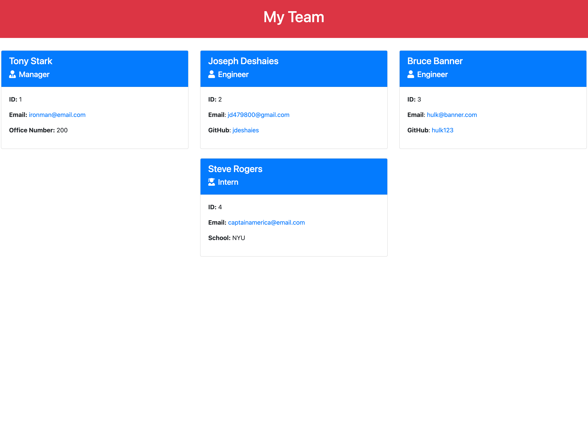

# Team Profile Generator

## Description

The purpose of this project is to have a manager input various pieces of information about themselves and the employees on their team to generate a team HTML page. This project utilizes node.js so that it can be run outisde of the client's browser and so that a user does not have to interact with a UI in order to use this application. This project also uses inquirer.js as a command line for the user so that they can easily input the correct employee information asked for (name, id, email, etc.). This program uses classes for each of the employee types (Manager, Engineer, Intern) and these classes are extended from the parent class Employee. Since this parent class has attributes such as name, id, and email, all the child classes inherit these attributes. However, the child classes also inclue unique attributes not found in the parent class (Manager has office number, Engineer has GitHub, and Intern has school information.) This page allows a manager to have quick access to the employees' emails and GitHub profiles because when these attributes are clicked, they open to a new email or GitHub profile.

This application also utilizes jest to run tests on the different classes. These tests confirm whether the different employee objects can be instantiated, the attributes can be set via constructor arguments, and whether specific information can be returned based on the get functions (ex: getRole(), getGitHub(), getSchool(), getName(), etc.)

## Table of Contents
- [Installation](#installation)
- [Usage](#usage)
- [License](#license)
- [Questions](#questions)

## Installation

In order to use this application, install the following:
1. npm init -y
2. npm install inquirer@8.2.4
3. npm install jest@24.9.0

## Usage

Use this application when you want to generate an HTML page with information of the employees on your team.

Click this link to see a video walkthrough of a sample README file generated: 
https://youtu.be/du9cZPtmcXE

## License

This application does not use any licenses currently.

## Questions

Visit my GitHub profile: https://github.com/jdeshaies

For any questions, please reach out to me via email: jd479800@gmail.com